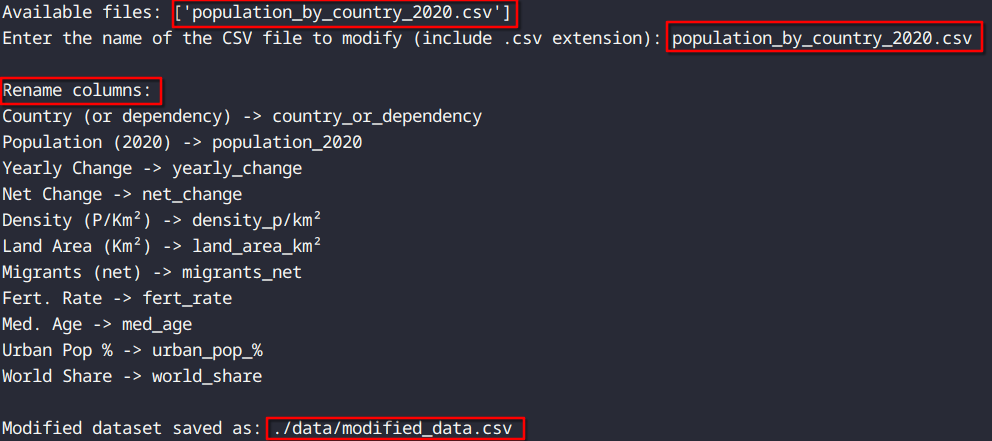
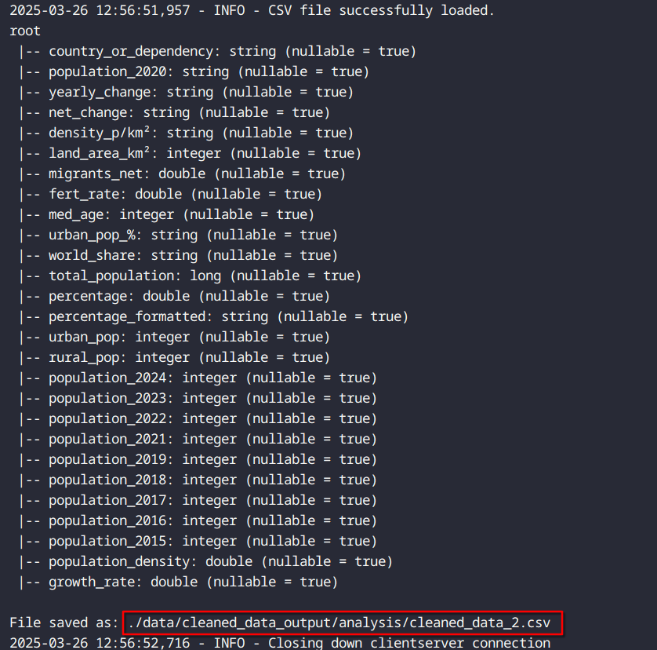

# Pyspark (First Approach)

## 📝 Description

This code demonstrates how to integrate PySpark with datasets and perform simple data transformations. It loads a sample dataset using PySpark's built-in functionalities or reads data from external sources and converts it into a PySpark DataFrame for distributed processing and manipulation.

# 🔥 What's pyspark?

- It's the Python API for Apache Spark, enabling the use of Spark with Python.

## 🔑 Key Features:

1. **Distributed Computing:** Processes large datasets across a cluster of computers for scalability.
2. **In-Memory Processing:** Speeds up computation by reducing disk I/O.
3. **Lazy Evaluation:** Operations are only executed when an action is triggered, optimizing performance.
4. **Rich Libraries:**
    - **Spark SQL:** Structured data processing (like SQL operations).
    - **MLlib:** Machine learning library for scalable algorithms.
    - **GraphX:** Graph processing (via RDD API).
    - **Spark Streaming:** Real-time stream processing.
5. **Compatibility:** Works with Hadoop, HDFS, Hive, Cassandra, etc.
6. **Resilient Distributed Datasets (RDDs):** Low-level API for distributed data handling.
7. **DataFrames & Datasets:** High-level APIs for structured data with SQL-like operations.

## ✅ Pros

- Handles massive datasets efficiently.
- Compatible with many tools (Hadoop, Cassandra, etc.).
- Built-in libraries for SQL, Machine Learning, Streaming, Graph Processing.

## ❌ Cons

- Can be memory-intensive.
- Complex configuration for cluster environments.

## 🔧 Install pyspark

1. Install via pip

```
pip install pyspark
```

2. Verify installation

```
python3 -c "import pyspark; print(pyspark.__version__)"
```

# 🛠️ Code Explanation 

## 👩‍💻 1. data_utils.py

### 🔧 Install libraries that we are going to need:

```
pip install kaggle pandas numpy
```

```
pip install windows-curses
```

### 📖 Explanation of the Code:

#### curses.wrapper(kaggle_connect):

- Lets the user search for datasets and choose one to download.
- Saves the dataset to a specified folder and loads the first CSV file into a DataFrame.

#### col_name(folder_path):

- Lists all files in the ./data folder.
- Lets the user pick a CSV file.
- Lets rename the columns converting them to lowercase and replacing spaces (" ") with underscores ("_") and parentheses ("()") and periods (.) with nothing.
- Saves the modified file as modified_data.csv in the same folder.

#### clean_data(folder_path):

- Reads a CSV, replaces "N.A." with NaN, converts NaN to 0, and saves the result as clean_data.csv.

### ✅ Example Output:


<br>



<br>


---

## 👩‍💻 2. pyspark_first_approach.py

### 🔧 Install libraries that we are going to need:

```
pip install pyspark matplotlib fpdf
```

### 📖 Explanation of the Code:

#### new_col(spark):

- The code loads a CSV, calculates the population percentage of each country, adds that information to the file, and saves it as **cleaned_data.csv**.

#### plot_data(spark):

- This code reads a CSV with PySpark, converts the data to Pandas, and creates a bar chart showing the top 10 countries by population percentage.

#### plot_pie_chart(spark):

- Reads the cleaned CSV, converts it to Pandas, selects the top 10 countries by population percentage, and generates a pie chart with percentages.

#### create_table(spark):

- This code reads a CSV file, selects the top 10 most populated countries, and generates a PDF with a table showing the country, population, and percentage. It then saves the PDF in a folder.

#### create_report(spark):

- This code reads a CSV file, selects data for all countries, and generates a PDF containing a table with country names, population, urban population, and percentages. It then saves the PDF to a specified folder.

### ✅ Example Output:

- **new_col(spark):**


- **plot_data(spark):**


- **plot_pie_chart(spark):**


- **create_table(spark):**


- **create_report(spark):**


---

## 👩‍💻 3. googlesheets.py

### 🔧 Install libraries that we are going to need:

```
pip install gspread google-auth google-auth-oauthlib google-auth-httplib2 pyspark
```

### 📖 Explanation of the Code:

#### pyspark(client):

- This code reads a CSV file, clears a Google Sheets document, and saves the CSV data into that sheet.

#### analysis(client):

- This code reads a CSV file, clears a Google Sheets document, and saves the CSV data into that sheet.

### ✅ Example Output:

- [pyspark Google Sheets Results](https://docs.google.com/spreadsheets/d/1pSiXTnYu4h5zXh78hBEJKnkdSa_W_9krg7BKcQdYI-4/edit?gid=976230421#gid=976230421)


- [analysis Google Sheets Results](https://docs.google.com/spreadsheets/d/18wRRxOMM7CLxhgdykeiBDs_8xr9kCg0ZIHyr7UFXw2k/edit?pli=1&gid=0#gid=0)


---

## 👩‍💻 4. analysis.py

### 🔧 Install libraries that we are going to need:

```
pip install pyspark
```

### 📖 Explanation of the Code:

#### previous_years(spark):

- The code loads a CSV into a **PySpark DataFrame**, calculates population estimates for multiple years, saves the result in a new CSV, renames the final file, removes unnecessary files, and handles logs and errors.

### ✅ Example Output:

- **previous_years(spark):**



